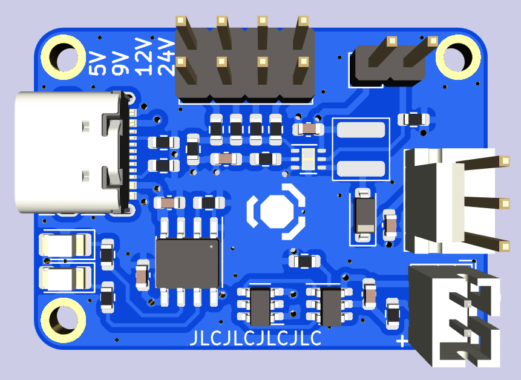

# USB Fan

Single-cell USB Fan with voltage selection and USB-C Charger built around `TP4056`+`DW01A` and `TPS61170`.

**This board is untested.**

Designed to be manufactured by [JLCPCB](https://jlcpcb.com/) as 4layer PCB.
*It is not possible to manufacture as 2layer PCB.*

## Features

- 4 fan voltages (5V / 9V / 12V / 24V)
  - Select **before** turning the SW1 on
- USB-C charging
  - 5V 1.5A max (5.1k resistors)
  - `TP4056` charger
    - Status LEDs
      - Red = Charging
      - Blue = Standby
    - 1S 1A charging (1 cell in series, unlimited in parallel)
  - 1.5A discharge (`DW01A`)
- Power-on switch
  - Only affects the output, battery can still charge
  - **Do not turn on when charging**
  - Minimum current runs through the switch
    - No special switch needed
    - It is not a toggle!

## TODO

- Power LED (white) ?
- Add assembly tooling holes
